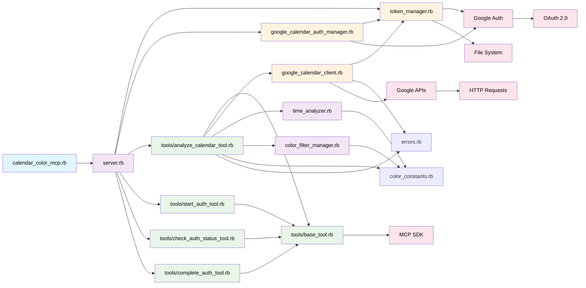

# lib/配下の依存関係図

## アーキテクチャ概要

### 階層構造

1. **エントリーポイント**: `calendar_color_mcp.rb`
   - アプリケーションの起動点

2. **コアサーバー**: `server.rb`
   - MCPツールの登録・管理
   - サーバーコンテキストの提供

3. **ツール層**: `tools/`
   - `analyze_calendar_tool.rb` - メインの分析機能
   - `start_auth_tool.rb` - 認証開始
   - `check_auth_status_tool.rb` - 認証状態確認
   - `complete_auth_tool.rb` - 認証完了
   - `base_tool.rb` - 共通基底クラス

4. **ビジネスロジック層**:
   - `time_analyzer.rb` - 時間分析ロジック
   - `color_filter_manager.rb` - 色フィルタリング

5. **インフラ層**:
   - `google_calendar_client.rb` - Google Calendar API連携
   - `token_manager.rb` - 認証情報管理
   - `google_calendar_auth_manager.rb` - OAuth管理

6. **共通モジュール**:
   - `color_constants.rb` - 色定義
   - `errors.rb` - エラークラス

### 主要な依存関係

- **AnalyzeCalendarTool** が最も複雑で、多くのコンポーネントに依存
- **ColorConstants** が共通の色定義として複数クラスから参照
- **TokenManager** がシングルトンとして認証情報を一元管理
- **BaseTool** が全てのツールクラスの基底クラスとして機能

### 外部依存

- **MCP SDK**: Model Context Protocol実装
- **Google APIs**: Calendar API v3
- **Google Auth**: OAuth 2.0認証
- **File System**: トークンファイル管理
