w# lib/配下の依存関係図

```mermaid
graph LR
    %% Entry Point
    Main[calendar_color_mcp.rb] --> Server[server.rb]
    
    %% Server Dependencies
    Server --> AnalyzeTool[interface_adapters/tools/analyze_calendar_tool.rb]
    Server --> StartAuthTool[interface_adapters/tools/start_auth_tool.rb]
    Server --> CheckAuthTool[interface_adapters/tools/check_auth_status_tool.rb]
    Server --> CompleteAuthTool[interface_adapters/tools/complete_auth_tool.rb]
    
    %% Tool Base Class
    BaseTool[interface_adapters/tools/base_tool.rb] --> MCP[MCP SDK]
    AnalyzeTool --> BaseTool
    StartAuthTool --> BaseTool
    CheckAuthTool --> BaseTool
    CompleteAuthTool --> BaseTool
    
    %% Interface Adapters Layer
    AnalyzeTool --> AnalyzeUseCase[application/use_cases/analyze_calendar_use_case.rb]
    AnalyzeTool --> CalendarAnalysisPresenter[interface_adapters/presenters/calendar_analysis_presenter.rb]
    StartAuthTool --> AuthenticateUseCase[application/use_cases/authenticate_user_use_case.rb]
    CheckAuthTool --> AuthenticateUseCase
    CompleteAuthTool --> AuthenticateUseCase
    
    %% Application Layer (depends on abstractions via dependency injection)
    AnalyzeUseCase --> CalendarRepoInterface{{calendar_repository interface}}
    AnalyzeUseCase --> TokenRepoInterface{{token_repository interface}}
    AnalyzeUseCase --> TimeAnalysisService[domain/services/time_analysis_service.rb]
    AnalyzeUseCase --> EventFilterService[domain/services/event_filter_service.rb]
    AuthenticateUseCase --> TokenRepoInterface
    AuthenticateUseCase --> OAuthServiceInterface{{oauth_service interface}}
    
    %% Infrastructure implements interfaces (dependency injection)
    GoogleCalendarRepo[infrastructure/repositories/google_calendar_repository.rb] -.-> CalendarRepoInterface
    TokenRepo[infrastructure/repositories/token_repository.rb] -.-> TokenRepoInterface
    GoogleOAuthService[infrastructure/services/google_oauth_service.rb] -.-> OAuthServiceInterface
    
    %% Domain Layer
    TimeAnalysisService --> ColorConstants[domain/entities/color_constants.rb]
    TimeAnalysisService --> CalendarEvent[domain/entities/calendar_event.rb]
    EventFilterService --> CalendarEvent
    EventFilterService --> Attendee[domain/entities/attendee.rb]
    EventFilterService --> Organizer[domain/entities/organizer.rb]
    CalendarEvent --> ColorConstants
    CalendarEvent --> Attendee
    CalendarEvent --> Organizer
    
    %% Infrastructure Layer
    GoogleCalendarRepo --> GoogleOAuthService
    GoogleCalendarRepo --> ConfigurationService[infrastructure/services/configuration_service.rb]
    GoogleCalendarRepo --> CalendarEvent
    TokenRepo --> GoogleOAuthService
    TokenRepo --> ConfigurationService
    GoogleOAuthService --> GoogleAPI[Google APIs]
    GoogleOAuthService --> FileSystem[File System]
    ConfigurationService --> FileSystem
    
    %% Note: Logging system (loggable.rb, logger_manager.rb) and error classes (errors.rb) 
    %% are omitted from this diagram for clarity as they are cross-cutting concerns
    %% used throughout multiple layers
    
    %% External Dependencies
    GoogleAPI --> HTTP[HTTP Requests]
    GoogleAPI --> OAuth[OAuth 2.0]
    
    %% Styling
    classDef entryPoint fill:#e1f5fe,color:#000
    classDef interfaceAdapters fill:#e8f5e8,color:#000
    classDef application fill:#fff3e0,color:#000
    classDef domain fill:#f3e5f5,color:#000
    classDef infrastructure fill:#ffe0b2,color:#000
    classDef interfaces fill:#e1f5fe,stroke:#01579b,stroke-width:2px,stroke-dasharray: 5 5,color:#000
    classDef external fill:#fce4ec,color:#000
    
    class Main entryPoint
    class AnalyzeTool,StartAuthTool,CheckAuthTool,CompleteAuthTool,BaseTool,CalendarAnalysisPresenter interfaceAdapters
    class AnalyzeUseCase,AuthenticateUseCase application
    class TimeAnalysisService,EventFilterService,CalendarEvent,ColorConstants,Attendee,Organizer domain
    class GoogleCalendarRepo,TokenRepo,GoogleOAuthService,ConfigurationService infrastructure
    class CalendarRepoInterface,TokenRepoInterface,OAuthServiceInterface interfaces
    class MCP,GoogleAPI,FileSystem,HTTP,OAuth external
```

## アーキテクチャ概要

### 階層構造（Clean Architecture）

1. **エントリーポイント**: `calendar_color_mcp.rb`
   - アプリケーションの起動点

2. **サーバー層**: `server.rb`
   - MCPツールの登録・管理
   - サーバーコンテキストの提供

3. **Interface Adapters層**: `interface_adapters/`
   - **Tools**: MCPプロトコルインターフェース実装
     - `analyze_calendar_tool.rb` - カレンダー分析ツール
     - `start_auth_tool.rb` - 認証開始ツール
     - `check_auth_status_tool.rb` - 認証状態確認ツール
     - `complete_auth_tool.rb` - 認証完了ツール
     - `base_tool.rb` - 共通基底クラス
   - **Presenters**: データ表示形式変換
     - `calendar_analysis_presenter.rb` - 分析結果表示形式変換

4. **Application層**: `application/`
   - **Use Cases**: ビジネスユースケース
     - `analyze_calendar_use_case.rb` - カレンダー分析ユースケース
     - `authenticate_user_use_case.rb` - ユーザー認証ユースケース

5. **Domain層**: `domain/`
   - **Entities**: ビジネスエンティティ
     - `calendar_event.rb` - カレンダーイベント
     - `attendee.rb` - 参加者
     - `organizer.rb` - 主催者
     - `color_constants.rb` - 色定数
   - **Services**: ドメインサービス
     - `time_analysis_service.rb` - 時間分析サービス
     - `event_filter_service.rb` - イベントフィルタリングサービス

6. **Infrastructure層**: `infrastructure/`
   - **Repositories**: データアクセス
     - `google_calendar_repository.rb` - Google Calendar API連携
     - `token_repository.rb` - 認証トークン管理
   - **Services**: 外部サービス連携
     - `google_oauth_service.rb` - Google OAuth実装
     - `configuration_service.rb` - 設定管理

### 横断的関心事（図には含まれていない）

以下のコンポーネントは複数の層で使用される横断的関心事のため、図の簡潔性を保つために省略されています：

- **ログシステム**:
  - `loggable.rb` - ログ機能提供モジュール（mixin）
  - `logger_manager.rb` - ログ管理クラス
- **エラー処理**:
  - 各層の`errors.rb` - 層固有のエラークラス群

### 主要な依存関係

- **Clean Architectureパターン**: 依存関係は内側の層へのみ向かう
- **依存性注入 (DI)**: Application層は抽象インターフェースに依存し、Infrastructure層の具象クラスが注入される
- **Use Casesが中核**: アプリケーションのビジネスロジックを統括
- **Repositoryパターン**: データアクセスを抽象化、インターフェースを通じて実装される
- **Presenterパターン**: データ表示形式を責務分離
- **Domain Services**: 複数エンティティにまたがるビジネスロジック
- **横断的関心事の分離**: ログとエラー処理は各層で独立して管理

### 図の記号説明

- **実線の矢印 (→)**: 直接的な依存関係
- **点線の矢印 (-.->)**: インターフェース実装（依存性注入）
- **破線のボックス**: 抽象インターフェース（実際のコードには存在しないが、概念的な依存先）

### 外部依存

- **MCP SDK**: Model Context Protocol実装
- **Google APIs**: Calendar API v3
- **OAuth 2.0**: Google認証プロトコル
- **File System**: トークン・設定ファイル管理
